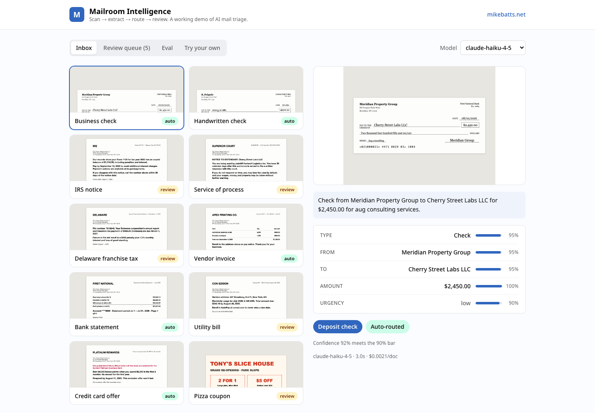

# Mailroom Intelligence

A working demo of AI mail triage, built for the team at Stable by [Mike Battaglia](https://mikebatts.net). **Live at [mailroom-intelligence.vercel.app](https://mailroom-intelligence.vercel.app).**



Scanned mail goes in. A vision model extracts who sent it, who it's for, amounts, deadlines, and urgency, each with its own confidence score. A routing policy then decides: auto-action it (deposit, scan, forward, shred) or send it to a human review queue. The whole loop is measured by an eval harness, because an AI pipeline without an eval is a demo, and with one it's a system.

Not affiliated with Stable. Every mail piece is synthetic, rendered from HTML.

## The eval

Two models, same prompt, same 10 labeled samples:

| Model | Doc type | Sender | Amount | Deadline | Action | Safe routing | Auto rate | Latency | Cost/doc |
|---|---|---|---|---|---|---|---|---|---|
| claude-haiku-4-5 | 100% | 100% | 100% | 100% | 90% | **100%** | 50% | 2.5s | $0.0022 |
| claude-sonnet-4-6 | 100% | 90% | 100% | 100% | 100% | **100%** | 60% | 5.1s | $0.0071 |

Safe routing = an item is never auto-actioned while a core field (type, amount, action) is wrong.

### What the eval changed

The first pass auto-routed a utility bill with the wrong action at 0.88 confidence. That's the failure mode that matters in a mailroom: not a wrong answer, a wrong answer acted on. Raising the auto-route threshold from 0.85 to 0.90 traded about 20 points of automation rate for 100% safe routing on this set. Small sample, honest tradeoff, and exactly the kind of decision you can only make on purpose when you measure.

Two policy decisions live in code, not in the prompt: high-stakes classes (legal service, government notices) always get human eyes regardless of confidence, and overall confidence is weighted toward the weakest field, so one illegible line sinks the score.

## Stack

- Next.js (App Router) + TypeScript + Tailwind
- GraphQL endpoint (Yoga) serving samples, extractions, and eval stats
- Claude vision models for extraction, provider-flexible (direct Anthropic API or OpenRouter)
- Synthetic mail rendered from HTML via headless Chrome, so the dataset is reproducible and private-data-free

## Run it

```bash
npm install
npm run dev            # uses cached extractions, no API key needed
```

Regenerate everything:

```bash
npm run render:samples # re-render the synthetic mail set
ANTHROPIC_API_KEY=... npm run precompute  # or OPENROUTER_API_KEY=...
npm run eval           # score against data/groundtruth.json, prints the table above
```

The deployed gallery runs entirely on cached results (zero inference cost). The "Try your own" upload calls the pipeline live when an API key is present in the environment, with basic rate limiting.
